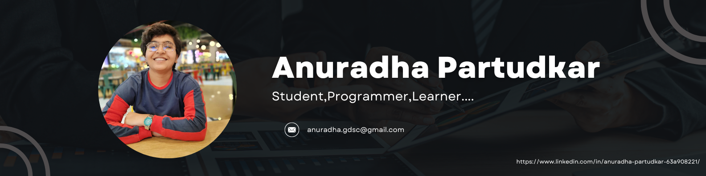

  

## 👋 About Me

- 🌱 I’m currently learning **React, Node.js, Docker, Kubernetes, and Prometheus.**
- 🎯 Passionate about SRE, DevOps, and Cloud Technologies.**
- 📫 How to reach me: **[anuradha.partudkar@gmail.com](mailto:anuradha.partudkar@gmail.com)**
- 📄 [View My Resume](#)  

## 🚀 Technical Skills

- **Programming Languages:** Python, C, C++
- **Web Development:** HTML, CSS, JavaScript, React
- **DevOps & Cloud:** Docker, Kubernetes, Jenkins, Prometheus, Grafana
- **Cybersecurity & IAM:** SailPoint IdentityIQ
- **Other Tools & Technologies:** Git, Linux, MySQL

## 📞 Connect with Me

  

## 📊 GitHub Stats

  

&nbsp;
  

